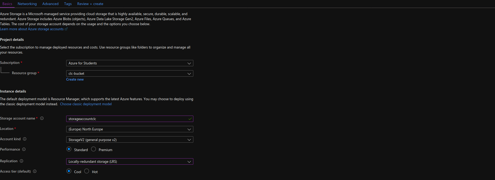
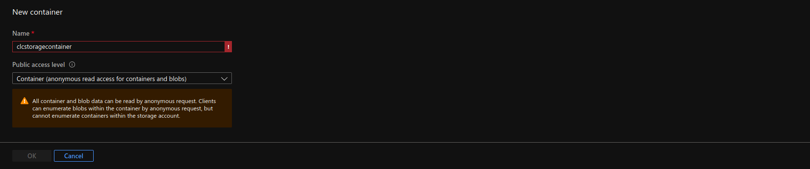

# Move data into the 'cloud'

This module will go into some details on how and why we have to move data into the cloud. It will also explain some more
intricate parts of the source code in this directory.

## Why

Currently our sample solution only works for local data, meaning it loads local files and outputs
them on the local hard drive. In order to run our solution in a cluster we need to provide the same source files
from a place the cluster can reach. In addition to that we need a place to store our results.

Because our cluster should be runnable everywhere we will setup some storage in the cloud and use a github GIST to serve
our source CSV files. In production you will probably want to serve your source files from a local HDFS cluster or something 
similar to that. 

## Reading source files

For the luigi example project we have two source files in the CSV format. The make it easy for us we will just paste
them using a github GIST. This is publicly available and free to use. The source files can downloaded [here](https://gist.github.com/falknerdominik/425d72f02bd58cb5d42c3ddc328f505f).
If you click on `RAW` (read: show the raw file) you can obtain a link that is reachable for anyone.

- [CSV 1](https://gist.githubusercontent.com/falknerdominik/425d72f02bd58cb5d42c3ddc328f505f/raw/4ad926e347d01f45496ded5292af9a5a5d67c850/test_file1.CSV)
- [CSV 2](https://gist.githubusercontent.com/falknerdominik/425d72f02bd58cb5d42c3ddc328f505f/raw/4ad926e347d01f45496ded5292af9a5a5d67c850/test_file2.CSV)

Fortunately for us pandas supports reading CSV files directly from an http[s] source. This is done by providing the
`pd.read_csv` function with the url.

```python
data_in: DataFrame = pd.read_csv(self.gist_input_url, sep=";")
```

## Saving the result

Because kubernetes decides on which node the code is executed the program can not make any assumption about the location or the underlying
filesystem structure. To accomplish this, the results are saved on a storage that is reachable from the cluster. There are
multiple storage providers (Google Cloud Storage, Dropbox, AWS S3, ...), but for the purposes of this how-to Azure Blob Storage
is used (This can be replaced by any option you like - or where you still have credits left).

### Creating the Storage [Azure]

Before creating a blob storage, you have to create a storage account. You can do this by simply searching for `storage account` and selecting 
`create`. Then fill out the form as shown below:

 
 
The storage account decides which plan you use (how much you
 pay), the actual data will reside in one of many storage types.  After that select your new account and search for `containers`.
 Add a new one like shown in the screenshot below:
 
 
 
Selecting the container will show you whats inside of it. A container like this can be used as a simple blob storage.
The pipeline will write any results here. For now take note of the container name (The one you filled in the form above).
 
To access the storage the pipeline needs a connection string. It contains every detail on how to connect securely to your storage (Account Name, Account Key).
It can be found inside your storage account in the `Access keys` section take a note of it.

> Be careful with connection strings. Do not commit them to your GIT repository, they grant total access (depending on 
>your policies) to your storage!

### Saving results with luigi

With the connection string and container name in hand you are well prepared to save the data into your blob storage. 
In the `simple_workflow.py` add these two strings:

```python
azure_connection_string = '<Insert-Connection-String>'
container_name = '<Insert-Container-Name>'
```

> Conveniently luigi supports azure blob storage out-of-the-box using the `luigi.contrib.azureblob.AzureBlobStorage` class. The
> connection is provided using the `luigi.contrib.azureblob.AzureBlobClient` class.

After that execute the pipeline and the results get saved to your storage. The output should look similar to this:

```text
DEBUG: Checking if PreprocessAllFiles() is complete
DEBUG: Checking if Preprocess(gist_input_url=https://gist.githubusercontent.com/falknerdominik/425d72f02bd58cb5d42c3ddc328f505f/raw/4ad926e347d01f45496ded5292af9a5a5d67c850/test_file1.CSV, connection_string=<CONNECTION_STRING>, filename=test_file1.CSV) is complete
DEBUG: Checking if Preprocess(gist_input_url=https://gist.githubusercontent.com/falknerdominik/425d72f02bd58cb5d42c3ddc328f505f/raw/4ad926e347d01f45496ded5292af9a5a5d67c850/test_file2.CSV, connection_string=<CONNECTION_STRING>, filename=test_file2.CSV) is complete
INFO: Informed scheduler that task   PreprocessAllFiles__99914b932b   has status   PENDING
INFO: Informed scheduler that task   Preprocess_DefaultEndpoints_test_file2_CSV_https___gist_git_6ab2dd2a85   has status   PENDING
INFO: Informed scheduler that task   Preprocess_DefaultEndpoints_test_file1_CSV_https___gist_git_62fd631f6d   has status   PENDING
INFO: Done scheduling tasks
INFO: Running Worker with 1 processes
DEBUG: Asking scheduler for work...
DEBUG: Pending tasks: 3
...
DEBUG:luigi-interface:There are no more tasks to run at this time
INFO: Worker Worker(salt=542199482, workers=1, host=andromeda, username=dfalkner, pid=11595) was stopped. Shutting down Keep-Alive thread
INFO:luigi-interface:Worker Worker(salt=542199482, workers=1, host=andromeda, username=dfalkner, pid=11595) was stopped. Shutting down Keep-Alive thread
INFO: 
===== Luigi Execution Summary =====

Scheduled 3 tasks of which:
* 3 ran successfully:
    - 2 Preprocess(...)
    - 1 PreprocessAllFiles()

This progress looks :) because there were no failed tasks or missing dependencies

===== Luigi Execution Summary =====
```

